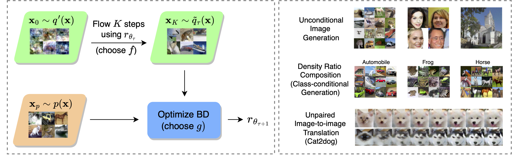

<div align="center">

# Generative Modeling with Flow-Guided Density Ratio Learning

[](https://arxiv.org/abs/2303.03714)
[](https://opensource.org/licenses/MIT)
[](https://ecmlpkdd.org/2024/)

</div>

<p align="center">
  
  <br />
  <span>Left: Illustration of FDRL's training setup for the tau training iteration. For clarity, we emphasize the choices of the f-divergence and g, the Bregman divergence function, as part of training. Right: the various applications of FDRL, ranging from unconditional image generation to class-conditional generation by composition with external classifiers and unpaired image-to-image translation. </span>
</p>

## Setup
There are a few setup steps to run through before we can start training and evaluating models. 

1. Install the relevant libraries. As the code was developed using Python 3.8, it is recommended to use an environment with the same Python version.
```bash
conda create -n <env name> python=3.8 # using conda environments is optional but highly recommended
conda activate <env name>
pip install -r requirements.txt
```

2. Next we need to generated the data-dependent prior distributions for the relevant datasets, as well as FID statistics for use in evaluation for CIFAR10 and CelebA.
```bash
python dataset_setup.py --data_dir <path/to/dataset> --dataset <cifar10/celeba/lsun_church> --device <eg: cuda:0, cpu>
```
See the `argparse` comments in `dataset_setup.py` for more details. This process will create a file `<dataset>_ddp.pt`, which is a multivariate Gaussian fitted to the dataset. For CIFAR10/CelebA, it additionally creates a file `eval/<dataset>_stats.npz`, which contains the necessary statistics for FID calculation during evaluation.

## Datasets
1. CIFAR10: downloaded automatically with PyTorch's `torchvision.datasets.CIFAR10` when executing training code.
2. CelebA: either automatically with `torchvision.datasets.CelebA` (which can be unreliable) or with instructions from the [official webpage](https://mmlab.ie.cuhk.edu.hk/projects/CelebA.html).
3. LSUN: refer to instructions from the [official Github](https://github.com/fyu/lsun).
4. Cat2dog: refer to instructions from the [DRIT Github](https://github.com/HsinYingLee/DRIT).

## Training
Training configs can be changed in the `configs/<dataset>.yaml` files. Crucially, you might wish to change the entries `data_dir` and `device`, which corresponds to where the dataset is stored, and which device(s) to use for training. You can vary the choices of Bregman divergence and f-divergences in the entries `loss_function` and `f_divergence`. `use_wandb` is an optional setting you can set to `true` if you wish to track your runs using [Weights and Biases](https://wandb.ai/site).

### Unconditional Generation (DDP)
To train a model with the data-dependent prior, run
```bash
python train_ddp.py --config ./configs/<dataset>.yaml # for cifar10, celeba and lsun_church only
```
Training results are stored in a data and timestamped folder in `results/<dataset>`. A model checkpoint will be saved under the `ckpt` folder every `save_steps` iterations as specified in the config, and samples from the model are plotted in `logs` every `log_steps` iterations.

### Image-to-image Translation
Image-to-image translation models can be trained in same way by running
```bash
python train_im2im_translation.py --config ./configs/cat2dog.yaml --device <cuda:0, cuda:1 etc>
```

## Evaluation

### Unconditional Generation and FID Scores
To evaluate the model for unconditional generation using DDP, run
```bash
python eval_ddp.py --ckpt <path/to/checkpoint> --device <cuda:0, cuda:1 etc>
```
It will save some samples of generated images in the `samples` folder. For CIFAR10 and CelebA, this will generate 50K images and compare the activation statistcs of the `pool3` layer in the InceptionV3 network with those calculated when running `eval_setup.py` earlier.

### Conditional Generation
To convert an unconditional model to a class-conditional generator, you will first need to download the pretrained robust classifier from [robustness Github](https://github.com/MadryLab/robustness) page, specifically the CIFAR10 L2-norm ResNet50 [ε = 1.0](https://www.dropbox.com/s/s2x7thisiqxz095/cifar_l2_1_0.pt?dl=0). **Do note that with Python 3.8, you will get an error when loading this model checkpoint as seen by this [issue](https://github.com/MadryLab/robustness/issues/71).** You can resolve this by running this whole project in Python 3.7 (but I have not tested if everything works in 3.7), or follow the linked issue: only load and resave the model in Python 3.7, the resultant checkpoint should work in 3.8.

After you have done so, you can perform conditional generation by using your CIFAR10 LR-KL checkpoint with the instructions in the `class_conditional_flow.ipynb`. The hyperparameters in the notebook are tuned only for LR-KL, so attempts with other models may produce different results.

### Image-to-image Translation
To run some test examples for image-to-image translation on the Cat2dog dataset, simply follow the instructions in the `eval_im2im_translation.ipynb` notebook.

## Pretrained Checkpoints
Checkpoints available under [releases](https://github.com/ajrheng/FDRL/releases).

## Contact
If you have any questions regarding the code or the paper, please email [Alvin](mailto:alvinh@comp.nus.edu.sg).

## BibTeX
If you find this repository or the ideas presented in our paper useful, please consider citing.
```
@article{heng2023generative,
  title={Generative Modeling with Flow-Guided Density Ratio Learning},
  author={Heng, Alvin and Ansari, Abdul Fatir and Soh, Harold},
  journal={arXiv preprint arXiv:2303.03714},
  year={2023}
}
```
